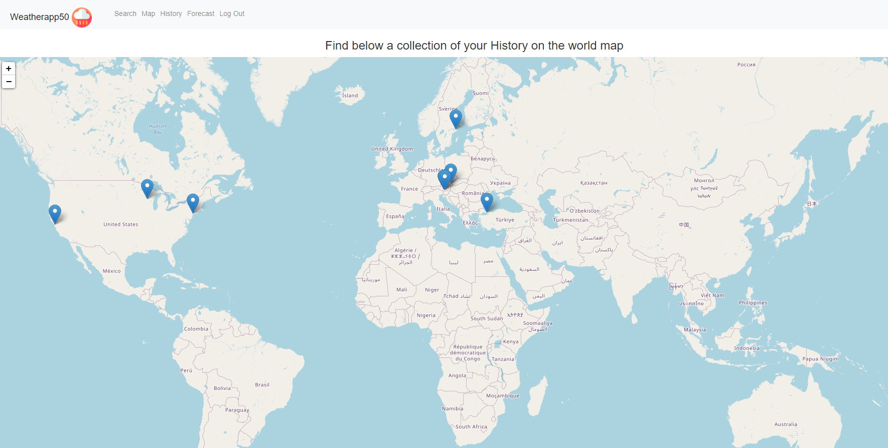

# This is my final CS50x project Wetherapp50.
## 
## Summary
> This web app was written using Flask, Python, HTML and CSS.Here is a <a href="https://www.youtube.com/watch?v=lLSJxZAYVBo&ab_channel=DavidK">link</a> to my video showcasing this app on youtube, feel free to check it out.  
With the Weatherapp50 you can get the current weather information for your requested location, as well as a forecast for the next 7 days. When such a weather-location request is sent, the server queries the OpenWeatherMap API for the information requested by the user. The returned data includes: weather condition, current temperature, sunrise time, sunset time as well as the current local time. 
The app also contains an interactive world map, which shows you the location of the search request with a pin on the map. This is done by using a Python library called Folium, which allowed me to include a visualization of the data.  
In the Weatherapp50 you can also view your search history, which is represented in a table, with information about your request as well as the option to get more detailed information. This was done by using a sqlite database.
## Add your own Api Key
> The Api used to get the weather information in this application is called OpenWeatherMap API. To add your API Key to the enviroment you need to type "export API_KEY=value" (value = your personal API Key) in the console.

